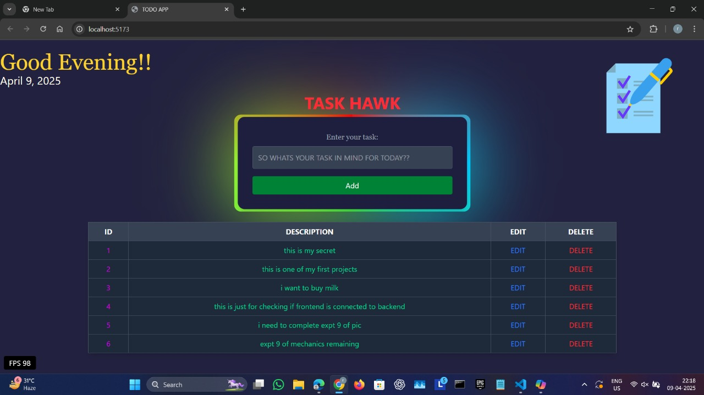

# Task Hawk – ToDo App

A basic full-stack ToDo app built using React (Vite) for frontend and Node.js with Express for backend.  
This was my first mern stack project built entirely by myself.

## 🛠️ Tech Stack

- Frontend: React (Vite)
- Backend: Node.js + Express
- Database: postgreSql
- Styling: tailwind CSS

## 📁 Folder Structure
root/ 
├── backend/
├── frontend/
 └── my-app/

## 🚀 Features of this app

- Add, Edit, and Delete tasks
- Frontend connected succesfully to backend
- To run the project navigate to backend -- nodemon index.js
- For running the frontend/myapp in terminal --npm run dev

## ❗ Note

This wasnt deployed and was only meant for learning and practice purposes.

## 📸 Screenshot

